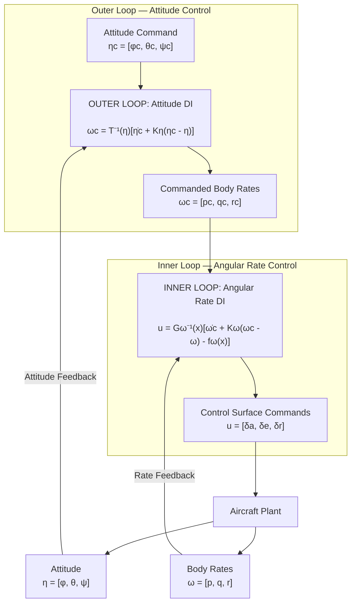

# Define the output states

$$ \eta = \begin{bmatrix} \phi \\ \theta \\ \psi \end{bmatrix}$$
- $\phi$ = roll angle
- $\theta$ = pitch angle
- $\psi$ = yaw angle

Call $T(\phi,\theta)$  the rotation matrix to back out Euler angles from p, q, r

$$ \boxed{ T(\phi,\theta) = \begin{bmatrix} 1 & \sin\phi\tan\theta & \cos\phi\tan\theta\\ 0 & \cos\phi & -\sin\phi\\ 0 & \sin\phi\sec\theta & \cos\phi\sec\theta \end{bmatrix} } $$

$$ \begin{bmatrix} \dot\phi\\ \dot\theta\\ \dot\psi \end{bmatrix} = \begin{bmatrix} 1 & \sin\phi\tan\theta & \cos\phi\tan\theta\\ 0 & \cos\phi & -\sin\phi\\ 0 & \frac{\sin\phi}{\cos\theta} & \frac{\cos\phi}{\cos\theta} \end{bmatrix} \begin{bmatrix} p\\ q\\ r \end{bmatrix} $$
Now we can say $$\dot\eta=T(\eta)\omega$$ which is useful for SOMETHING

# Attitude error declaration

$$ e_\eta = \eta_c - \eta $$
Expand that out:
$$ e_\eta = \begin{bmatrix} \phi_c - \phi \\ \theta_c - \theta \\ \psi_c - \psi \end{bmatrix} $$
Now make the error decrease with time:
$$ \dot{e}_\eta = -K_\eta e_\eta $$
$$ K_\eta= \begin{bmatrix} k_\phi & 0 & 0 \\ 0 & k_\theta & 0 \\ 0 & 0 & k_\psi \end{bmatrix} $$
Set desired error rate equal to the error rate:
$$ \dot\eta_c - \dot\eta = -K_\eta (\eta_c-\eta) $$
$$ \boxed{ \dot\eta = \dot\eta_c + K_\eta(\eta_c-\eta) } $$
# Convert Euler Angle Rate Into Body Rate

Relate the desired angular rates to the body rates
$$ \omega_c = T^{-1}\dot\eta $$

Extend that to the cascaded DI and it ends up as:
$$ \boxed{\omega_c = T^{-1} [\dot\eta_c + K_\eta(\eta_c-\eta)]} $$
$$ \boxed{ u= G_\omega^{-1}(x) \left[ \dot\omega_c + K_\omega(\omega_c-\omega) - f_\omega(x) \right]}$$

